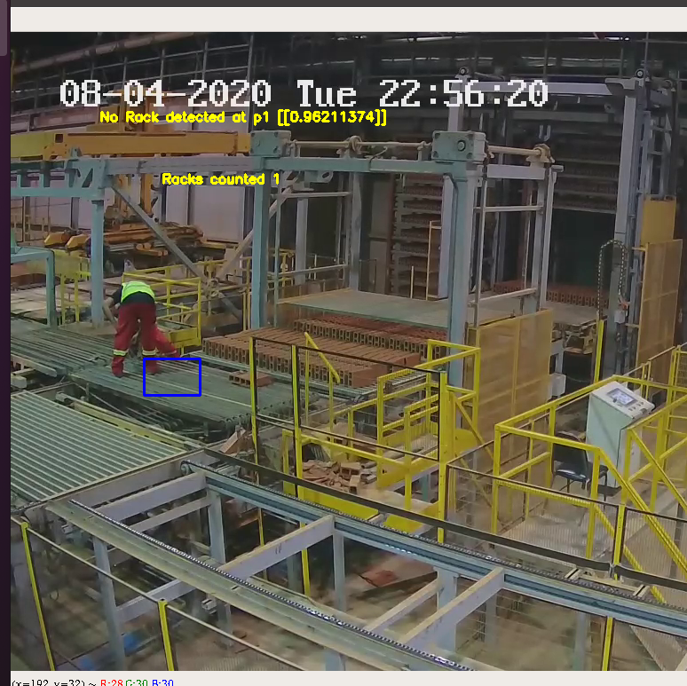
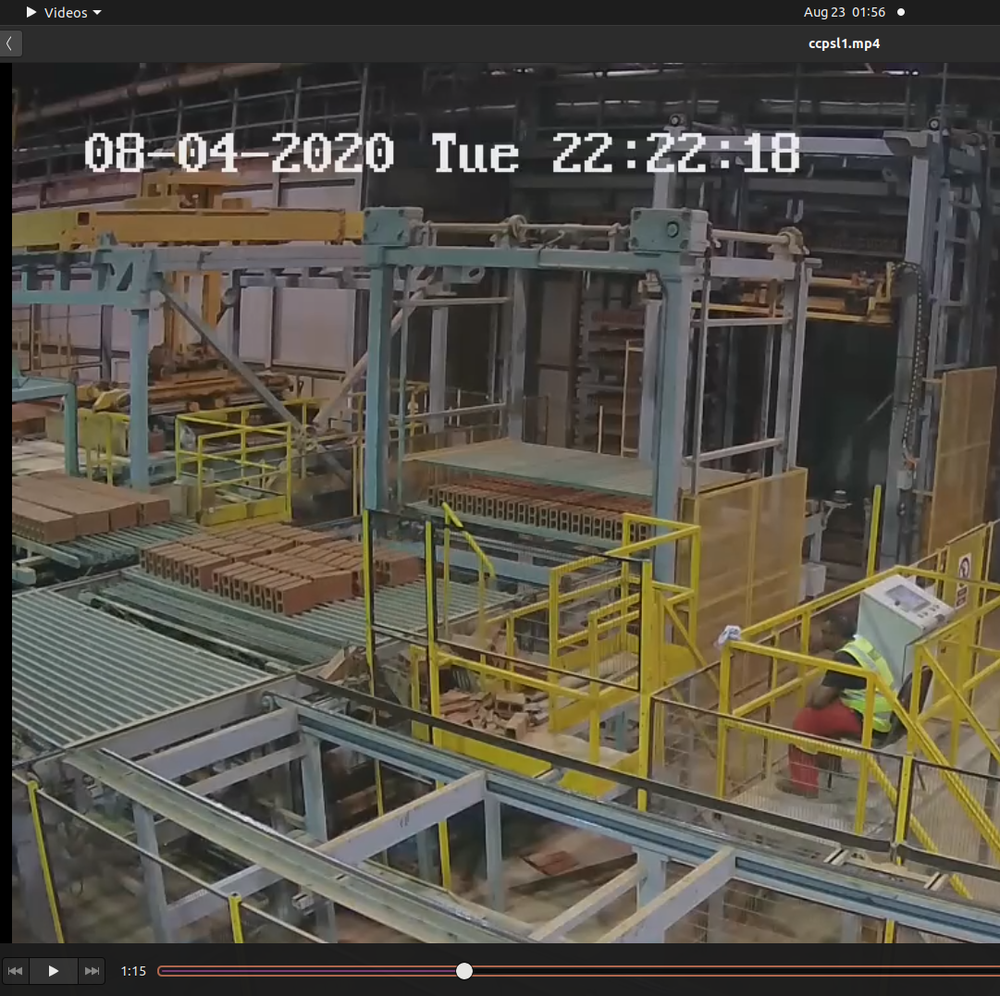
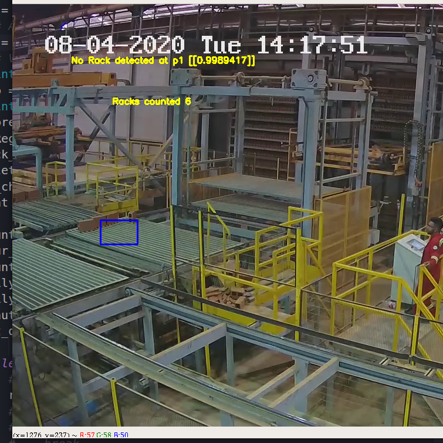
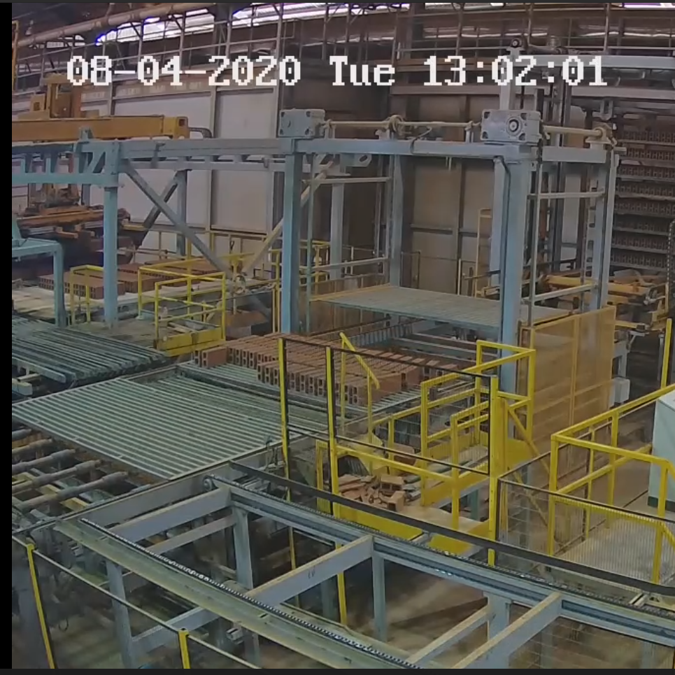

### Automatic live plant updates for CCPSL

This Repo contains the development code for a Live Plant Update system, developed for a brick factory during an intership at CCPSL(Caribbean clay Processing Services Ltd).

## Known Bugs
- The models confidence comes very close to to thresshold when workers are in the counting on the line (But still has low false positive rate)
- Half rack are counted 

## Known Limitations
- Camera once Set can't be moved or performance of the system may degrade.
- Region need to be manually added once at first.

## Testing 
Test case 1: No disturbace

All raacks were counted without Miscount

Test case 2: Maintainence on the Line 

During the entire maintaience video the system miscounted once.

Test Case 3: Half Racks

These racks were counted.

Test Case 4: A few bricks

This Rack was ignored by the system 

Test Case 5: Stationery Line (No Racks)

Test Case 6: Stationery Line (Racks)

Test Case 7: Bricks Missing 
Video: testing_clips/bricks_missing.mp4

